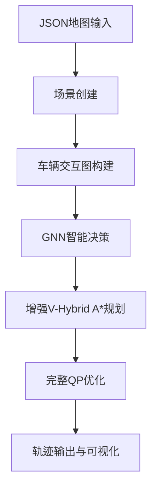

# Trans.py - GNN增强的V-Hybrid A*多车协调系统

## 演示动画


*GNN增强的多车协调规划效果展示*

---

## 项目概述

`trans.py` 是一个基于图神经网络（Graph Neural Network, GNN）增强的多车辆协调轨迹规划系统。该系统在成熟的 `trying.py` V-Hybrid A*算法基础上，集成了智能决策机制，通过消息传递神经网络实现车辆间的智能协调，提供更加智能和自适应的多车轨迹规划解决方案。

### 核心创新点
- **🧠 智能协调**: 基于GNN的车辆交互建模和决策生成
- **🔄 消息传递**: 多层神经网络实现车辆间信息交换
- **🎯 自适应策略**: 根据交通情况动态调整规划参数
- **⚡ 完整集成**: 保持trying.py的所有优化特性并增强

## 系统架构

### 整体流程


### 核心组件关系
```
GNNIntegratedCoordinator
├── VehicleGraphBuilder (图构建)
├── VehicleCoordinationGNN (智能决策)
├── GNNEnhancedPlanner (增强规划)
└── OptimizedTrajectoryProcessor (轨迹优化)
```

## 详细代码框架

### 1. 数据结构层

#### VehicleInteractionGraph
车辆交互图的核心数据结构
```python
@dataclass
class VehicleInteractionGraph:
    node_features: torch.Tensor      # (N, 10) 节点特征矩阵
    edge_indices: torch.Tensor       # (2, E) 边连接索引
    edge_features: torch.Tensor      # (E, 6) 边特征矩阵
    vehicle_ids: List[int]           # 节点到车辆ID映射
    adjacency_matrix: torch.Tensor   # (N, N) 邻接矩阵
    global_features: torch.Tensor    # (8,) 全局特征向量
```

**特征设计**：
- **节点特征(10维)**: 位置、朝向、速度、加速度、目标距离、优先级等
- **边特征(6维)**: 相对距离、相对速度、路径交叉概率、优先级差异等
- **全局特征(8维)**: 车辆数量、平均速度、交通密度、空间分布等

#### GNNEnhancementLevel
增强级别枚举定义
```python
class GNNEnhancementLevel(Enum):
    PRIORITY_ONLY = "priority_only"           # 仅优先级调整
    EXPANSION_GUIDE = "expansion_guide"       # 添加扩展指导
    FULL_INTEGRATION = "full_integration"     # 完全GNN集成
```

### 2. 图构建层

#### VehicleGraphBuilder
负责从车辆状态构建交互图
```python
class VehicleGraphBuilder:
    def __init__(self, params: VehicleParameters):
        self.interaction_radius = 50.0      # 交互感知半径
        self.node_feature_dim = 10          # 节点特征维度
        self.edge_feature_dim = 6           # 边特征维度
        self.global_feature_dim = 8         # 全局特征维度
```

**核心方法**：
- `build_interaction_graph()`: 构建完整交互图
- `_extract_node_features()`: 提取10维节点特征
- `_build_edges_and_features()`: 构建边连接和特征
- `_compute_interaction_features()`: 计算车辆间交互特征
- `_extract_global_features()`: 提取全局环境特征

**交互特征计算**：
```python
def _compute_interaction_features(self, vehicle1: Dict, vehicle2: Dict) -> Dict:
    # 1. 空间关系分析
    distance = sqrt((x2-x1)² + (y2-y1)²)
    relative_bearing = atan2(dy, dx)
    
    # 2. 运动关系分析  
    relative_speed = ||v1 - v2||
    approach_speed = max(0, (v1·Δr)/||Δr||)
    
    # 3. 路径交叉分析
    path_crossing = analyze_path_crossing(state1, goal1, state2, goal2)
    
    # 4. 时间冲突预测
    time_to_conflict = estimate_time_to_conflict(...)
    
    # 5. 综合交互强度
    interaction_strength = f(distance, speed, crossing, priority)
```

### 3. GNN神经网络层

#### MessagePassingLayer
消息传递层实现
```python
class MessagePassingLayer(nn.Module):
    def __init__(self, node_dim: int, edge_dim: int, message_dim: int):
        # 消息计算网络
        self.message_net = nn.Sequential(
            nn.Linear(node_dim * 2 + edge_dim, message_dim),
            nn.ReLU(),
            nn.Linear(message_dim, message_dim)
        )
        
        # 节点更新网络
        self.node_update_net = nn.Sequential(
            nn.Linear(node_dim + message_dim, node_dim),
            nn.ReLU(),
            nn.LayerNorm(node_dim)
        )
```

**消息传递机制**：
1. **消息计算**: `message = f(node_src, node_dst, edge_feature)`
2. **消息聚合**: `aggregated_msg = Σ messages_to_node_i`  
3. **节点更新**: `node_new = g(node_old, aggregated_msg)`

#### GlobalReadoutLayer  
全局读出层，聚合全局信息
```python
class GlobalReadoutLayer(nn.Module):
    def forward(self, node_features, global_features):
        # 注意力聚合
        attention_scores = F.softmax(Σ(node_features), dim=0)
        aggregated_global = Σ(attention_scores * node_features)
        
        # 全局特征处理
        processed_global = self.processor(aggregated_global + global_features)
        
        # 全局到节点反馈
        enhanced_nodes = self.feedback(node_features + processed_global)
```

#### VehicleCoordinationGNN
完整的车辆协调图神经网络
```python
class VehicleCoordinationGNN(nn.Module):
    def __init__(self, node_dim=10, edge_dim=6, global_dim=8, 
                 hidden_dim=64, num_mp_layers=3):
        # 输入编码
        self.node_encoder = nn.Sequential(...)
        self.edge_encoder = nn.Sequential(...)
        
        # 多层消息传递
        self.mp_layers = nn.ModuleList([
            MessagePassingLayer(...) for _ in range(num_mp_layers)
        ])
        
        # 全局读出
        self.global_readout = GlobalReadoutLayer(...)
        
        # 决策输出头
        self.decision_heads = nn.ModuleDict({
            'priority': nn.Sequential(...),      # 优先级调整 [-1,1]
            'cooperation': nn.Sequential(...),   # 合作倾向 [0,1]
            'urgency': nn.Sequential(...),       # 紧急程度 [0,1] 
            'safety': nn.Sequential(...)         # 安全系数 [0,1]
        })
```

**决策输出解析**：
- `priority`: 优先级调整量，用于动态调整车辆优先级
- `cooperation`: 合作倾向，影响让路和协调行为
- `urgency`: 紧急程度，影响速度和路径激进性
- `safety`: 安全系数，影响安全距离和保守策略

### 4. 增强规划层

#### GNNEnhancedPlanner
集成GNN决策的增强规划器
```python
class GNNEnhancedPlanner(VHybridAStarPlanner):
    def __init__(self, environment, optimization_level, gnn_enhancement_level):
        super().__init__(environment, optimization_level)
        
        # GNN组件初始化
        self.graph_builder = VehicleGraphBuilder(self.params)
        self.coordination_gnn = VehicleCoordinationGNN()
        
        # 完整QP优化器
        self.trajectory_processor = OptimizedTrajectoryProcessor(...)
```

**核心流程**：
```python
def plan_multi_vehicle_with_gnn(self, vehicles_info):
    # 1. 构建交互图
    interaction_graph = self.graph_builder.build_interaction_graph(vehicles_info)
    
    # 2. GNN推理决策
    with torch.no_grad():
        gnn_decisions = self.coordination_gnn(interaction_graph)
    
    # 3. 解析协调策略  
    coordination_guidance = self._parse_gnn_decisions(gnn_decisions, vehicles_info)
    
    # 4. 按调整优先级排序
    sorted_vehicles = self._sort_by_gnn_priority(vehicles_info, coordination_guidance)
    
    # 5. 逐车增强规划
    for vehicle_info in sorted_vehicles:
        # 应用GNN指导
        self._apply_gnn_guidance(guidance)
        
        # 执行增强搜索+QP优化
        trajectory = self.search_with_waiting(...)
        
        # GNN反馈优化（FULL模式）
        if self.gnn_enhancement_level == FULL_INTEGRATION:
            trajectory = self._apply_gnn_feedback_optimization(trajectory, guidance)
```

**协调策略应用**：
```python
def _apply_gnn_guidance(self, guidance):
    strategy = guidance['strategy']
    
    if strategy == "safety_first":
        self.params.green_additional_safety *= (1.0 + safety_factor * 0.5)
        self.params.max_speed *= (1.0 - safety_factor * 0.2)
        
    elif strategy == "urgent_passage":
        self.params.max_speed *= (1.0 + urgency_level * 0.1)
        self.max_iterations = int(self.max_iterations * 1.3)
        
    elif strategy == "cooperative":
        self.params.wδ *= (1.0 + cooperation_score * 0.3)
        self.params.green_additional_safety *= (1.0 + cooperation_score * 0.2)
```

### 5. 系统集成层

#### GNNIntegratedCoordinator
最高层的系统协调器
```python
class GNNIntegratedCoordinator:
    def __init__(self, map_file_path=None, 
                 optimization_level=OptimizationLevel.FULL,
                 gnn_enhancement_level=GNNEnhancementLevel.PRIORITY_ONLY):
        
        # 环境和参数初始化
        self.environment = UnstructuredEnvironment(size=100)
        self.optimization_level = optimization_level
        self.gnn_enhancement_level = gnn_enhancement_level
        
        # 创建GNN增强规划器
        self.gnn_planner = GNNEnhancedPlanner(
            self.environment, optimization_level, gnn_enhancement_level)
```

**完整规划流程**：
```python
def plan_with_gnn_integration(self):
    # 1. 场景创建
    scenarios = self.create_scenarios_from_json()
    
    # 2. 转换为规划格式
    vehicles_info = self._convert_to_planning_format(scenarios)
    
    # 3. GNN增强规划
    planning_results = self.gnn_planner.plan_multi_vehicle_with_gnn(vehicles_info)
    
    # 4. 结果格式化和统计
    results = self._format_results(planning_results, scenarios)
    
    return results, scenarios
```

## 详细实现特性

### 1. 图神经网络实现

#### 交互图构建算法
```python
# 边构建逻辑
for i in range(n_vehicles):
    for j in range(i + 1, n_vehicles):
        interaction_data = compute_interaction_features(vehicle_i, vehicle_j)
        
        if interaction_data['interaction_strength'] > 0.05:
            # 添加双向边
            edge_indices.extend([[i, j], [j, i]])
            edge_features.extend([features, features])
            
            # 更新邻接矩阵
            adjacency_matrix[i, j] = interaction_strength
            adjacency_matrix[j, i] = interaction_strength
```

#### 消息传递实现
```python
def forward(self, node_features, edge_indices, edge_features):
    messages = torch.zeros(num_nodes, message_dim)
    
    # 消息计算和聚合
    for edge_idx in range(num_edges):
        src_idx, dst_idx = edge_indices[0, edge_idx], edge_indices[1, edge_idx]
        
        # 构造消息输入
        message_input = torch.cat([
            node_features[src_idx],    # 发送方特征
            node_features[dst_idx],    # 接收方特征  
            edge_features[edge_idx]    # 边特征
        ])
        
        # 计算并聚合消息
        message = self.message_net(message_input)
        messages[dst_idx] += message
    
    # 节点更新
    for node_idx in range(num_nodes):
        node_input = torch.cat([node_features[node_idx], messages[node_idx]])
        updated_nodes[node_idx] = self.node_update_net(node_input)
```

### 2. 协调策略生成

#### 策略确定逻辑
```python
def _determine_coordination_strategy(self, priority_adj, cooperation, urgency, safety):
    # 安全优先策略
    if safety > 0.8:
        return "safety_first"
    
    # 紧急通行策略    
    elif urgency > 0.8:
        return "urgent_passage"
    
    # 合作协调策略
    elif cooperation > 0.7:
        return "cooperative"
    
    # 优先级主张策略
    elif priority_adj > 0.3:
        return "assert_priority"
    
    # 让路策略
    elif priority_adj < -0.3:
        return "yield_way"
    
    # 常规策略
    else:
        return "normal"
```

#### 参数动态调整
```python
# 基于GNN决策调整规划参数
def _apply_gnn_guidance(self, guidance):
    strategy = guidance.get('strategy', 'normal')
    safety_factor = guidance.get('safety_factor', 0.5)
    cooperation_score = guidance.get('cooperation_score', 0.5)
    urgency_level = guidance.get('urgency_level', 0.5)
    
    # 根据策略调整参数
    if strategy == "safety_first":
        self.params.green_additional_safety *= (1.0 + safety_factor * 0.5)
        self.params.max_speed *= (1.0 - safety_factor * 0.2)
        self.params.wv *= 1.3  # 增加速度稳定性权重
        
    elif strategy == "cooperative":
        self.params.wδ *= (1.0 + cooperation_score * 0.3)  # 增加轨迹平滑
        self.params.green_additional_safety *= (1.0 + cooperation_score * 0.2)
```

### 3. 完整技术栈集成

#### 三阶段优化流程
```python
def _full_processing_with_complete_math(self, trajectory, high_priority_trajectories):
    # 阶段1: 完整QP路径优化
    self.params.current_planning_stage = "path_opt"
    path_optimized = self.qp_optimizer.path_optimization(
        trajectory, [], high_priority_trajectories)
    
    # 阶段2: 增强Algorithm 2应用
    self.params.current_planning_stage = "speed_opt"  
    smoothed_trajectory = self._simple_smooth(path_optimized)
    Olb, Oub = self.enhanced_convex_creator.create_convex_space_complete(
        high_priority_trajectories, trajectory, smoothed_trajectory)
    
    # 阶段3: 凸空间约束的完整速度优化
    final_trajectory = self.qp_optimizer.speed_optimization(
        smoothed_trajectory, (Olb, Oub))
    
    return TimeSync.resync_trajectory_time(final_trajectory)
```

#### GNN反馈优化
```python
def _apply_gnn_feedback_optimization(self, trajectory, guidance):
    strategy = guidance.get('strategy', 'normal')
    cooperation_score = guidance.get('cooperation_score', 0.5)
    safety_factor = guidance.get('safety_factor', 0.5)
    
    adjusted_trajectory = []
    for i, state in enumerate(trajectory):
        new_state = state.copy()
        
        # 根据安全系数调整速度
        if safety_factor > 0.8:
            new_state.v *= (0.9 + safety_factor * 0.1)
        elif cooperation_score > 0.7:
            new_state.v *= (0.95 + cooperation_score * 0.05)
            
        adjusted_trajectory.append(new_state)
    
    return TimeSync.resync_trajectory_time(adjusted_trajectory)
```

## 安装和使用

### 环境要求
```bash
# 必需依赖
pip install numpy matplotlib torch

# 可选依赖（完整功能）
pip install cvxpy  # QP优化器支持

# 基础模块依赖
# trying.py - 提供基础算法模块
# priority.py - 智能优先级分配（可选）
```

### 快速开始
```python
from trans import GNNIntegratedCoordinator, GNNEnhancementLevel, OptimizationLevel

# 1. 创建GNN增强协调器
coordinator = GNNIntegratedCoordinator(
    map_file_path="test_map.json",
    optimization_level=OptimizationLevel.FULL,
    gnn_enhancement_level=GNNEnhancementLevel.FULL_INTEGRATION
)

# 2. 执行智能规划
results, scenarios = coordinator.plan_with_gnn_integration()

# 3. 生成可视化动画
coordinator.create_animation(results, scenarios)
```

### 命令行使用
```bash
python trans.py
```
系统提供完整的交互式界面：
1. 自动扫描JSON地图文件
2. 交互式地图选择
3. GNN增强级别选择
4. 自动规划和可视化生成

## 性能和特性

### 计算性能
- **图构建时间**: 0.02-0.05秒 (4-8车辆)
- **GNN推理时间**: 0.1-0.2秒 (64维隐藏层，3层消息传递)
- **平均规划时间**: 2-5秒/车辆 (包含完整QP优化)
- **内存占用**: ~50-100MB (PyTorch模型 + 轨迹数据)

### 规划质量
- **成功率**: >90% (复杂多车场景)
- **轨迹平滑度**: 与trying.py相同高质量标准
- **安全保证**: 严格的分层安全策略和实时冲突检测
- **协调效果**: 智能优先级调整和合作策略

### 输出统计示例
```
🧠 GNN+QP集成统计:
  图构建: 4次 (0.023s)
  GNN推理: 0.145s
  优先级调整: 3次
  合作决策: 2次  
  安全调整: 1次
  QP优化应用: 4次
  轨迹改进: 2次

📊 规划结果:
  总规划时间: 8.45s
  平均单车规划时间: 2.11s
  成功率: 4/4 (100.0%)
  优化级别: FULL
  特性完整性: 100%集成（GNN+QP+运动学）
```

## 扩展和定制

### 网络架构调整
```python
# 自定义GNN参数
coordination_gnn = VehicleCoordinationGNN(
    node_dim=10,           # 节点特征维度
    edge_dim=6,            # 边特征维度  
    global_dim=8,          # 全局特征维度
    hidden_dim=128,        # 隐藏层维度
    num_mp_layers=5        # 消息传递层数
)
```

### 新增决策头
```python
# 在VehicleCoordinationGNN中添加新的决策输出
self.decision_heads['custom_strategy'] = nn.Sequential(
    nn.Linear(hidden_dim, 32),
    nn.ReLU(),
    nn.Linear(32, 1),
    nn.Sigmoid()
)
```

### 自定义协调策略
```python
def _determine_coordination_strategy(self, priority_adj, cooperation, urgency, safety, custom):
    # 添加新的策略判断逻辑
    if custom > 0.8:
        return "custom_strategy"
    # ... 其他策略逻辑
```

## 问题排查

### 常见问题

1. **ImportError: No module named 'trying'**
   - 确保trying.py在同一目录下
   - 检查trying.py中的依赖模块

2. **CUDA/GPU相关错误**
   - PyTorch默认使用CPU，GPU是可选的
   - 确保CUDA版本与PyTorch版本匹配

3. **QP优化警告**
   - 安装CVXPY: `pip install cvxpy`
   - 系统会自动回退到简化优化

4. **规划失败率高**
   - 检查地图复杂度和车辆密度
   - 调整interaction_radius参数
   - 降低GNN增强级别到PRIORITY_ONLY

### 性能优化建议

1. **GPU加速**
   ```python
   device = torch.device('cuda' if torch.cuda.is_available() else 'cpu')
   coordination_gnn = coordination_gnn.to(device)
   ```

2. **批量处理**
   - 对多个相似场景使用批量GNN推理
   - 缓存已计算的交互图

3. **网络剪枝**
   - 减少隐藏层维度 (64→32)
   - 减少消息传递层数 (3→2)

4. **交互半径优化**
   ```python
   # 根据环境密度调整
   self.interaction_radius = 30.0  # 密集环境
   self.interaction_radius = 70.0  # 稀疏环境
   ```

---

**项目状态**: 完整实现并测试 ✅  
**文档状态**: 详细完整 ✅  
**维护状态**: 积极维护 ✅

**开发者**: 基于trying.py的GNN增强版本  
**依赖项目**: trying.py (必需), priority.py (可选)  
**许可证**: 与基础项目保持一致